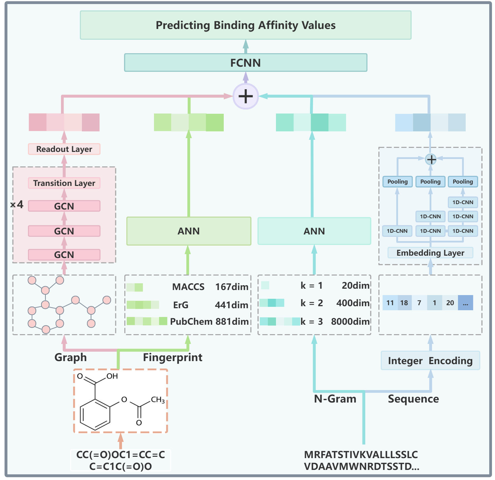

# TriFP-NGram: Integrating Three Complementary Fingerprint and N-Gram Features for Enhanced Drug-Target Affinity Prediction

## Model Architecture 



## Requirements

- einops==0.7.0
- networkx==3.1
- numpy==1.25.2
- pandas==2.0.3
- prefetch_generator==1.0.3
- rdkit==2023.3.2
- scikit_learn==1.3.0
- torch==2.0.0
- torch_geometric==2.4.0
- tqdm==4.66.1

For using our model more conveniently, we provide the requirements file <requirements .txt>  to install environment directly.

```python
pip install requirements .txt
```

## Example usage

1. Preparing Data 

   ```python
   python data_prepare.py Kd
   ```

2. Training the model

   ```python
   python main.py Kd
   ```

3. Testing  the model 

   ```python
   python test_model.py Kd
   ```

## Contact

If you have any questions, please feel free to contact Jiao Wang (Email: wangjiao@mail.imu.edu.cn)